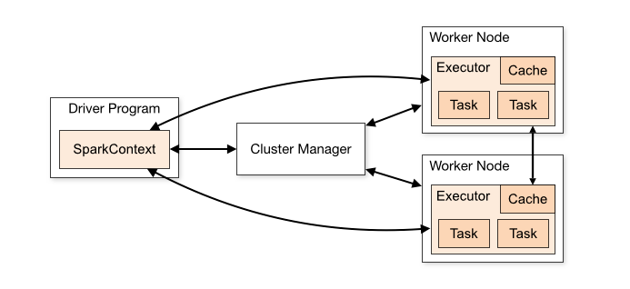
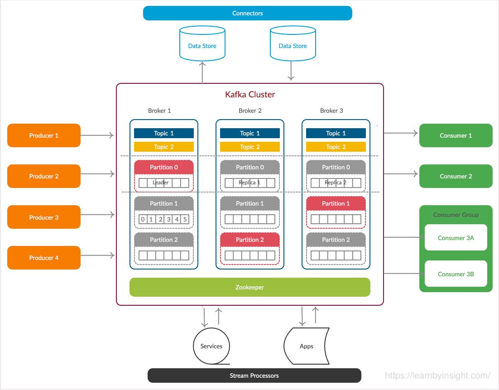

# 🌃 Apache kafka Self-Learning 🌊
A third-year student is self-studying Spark and Kafka as part of their data engineering journey, with the goal of securing an internship or fresher job in 2024.

## 📦 Technologies
 - `Docker`
 - `PostgreSQL`
 - `Apache Spark`
 - `Apache Kafka`
 - `Zookeeper`

## 🔦 Architecture

### 1. Apache Spark

 - `SparkContext`
 - `Driver Program`
 - `Cluster Manager`
 - `Worker Node`
 - `Executor`
 - `Cache`
 - `Task`

### 2. Apache Kafka

 - `Producer`
 - `Consumer`
 - `Broker`
 - `Cluster`
 - `Topic`
 - `Partition`
 - `Offset`
 - `Consumer-group`